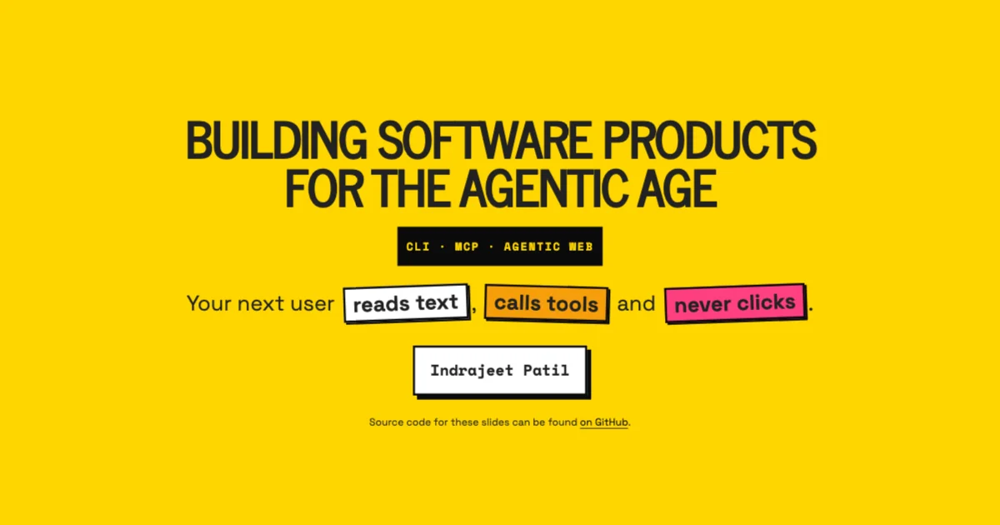

# Building Software Products for the Agentic Age

[](https://github.com/IndrajeetPatil/software-for-agentic-age/actions/workflows/build-presentation.yaml)

> [!NOTE]
> This deck is a **draft**. Pushes to `main` do not render or deploy yet.

This presentation covers what it takes for software products and websites to work well with AI agents:

- **Products agents can operate**: agent-friendly CLIs, stateless MCP servers (spec 2026-07-28), and how GitHub (`gh`) and Azure (`az`) do it well, plus package docs for agents (`llms.txt` and its variants) and indexing them in Context7.
- **Websites agents can read**: choosing whether to take part, robots.txt and Content Signals, `llms.txt`, Markdown for agents, structured data and trust signals, on top of the SEO and accessibility basics that still matter.
- **Measuring readiness** with Cloudflare's [Is It Agent Ready?](https://isitagentready.com/) and Vercel's [Is Agentic](https://is-agentic.com/).

The slides will be available here once published:<br>
<https://www.indrapatil.com/software-for-agentic-age/>



## Design

The visual design is inspired by [loot-drop.io](https://www.loot-drop.io/): a saturated yellow canvas, heavy ink outlines, hard offset shadows, tilted cards, and Space Grotesk / Space Mono type.
Colours and fonts are defined once in [`_brand.yml`](_brand.yml) using Quarto's [brand.yml](https://quarto.org/docs/authoring/brand.html) support; [`style.css`](style.css) adds the component shapes.

## Image credits

Third-party images keep their own licences; the [CC0](LICENSE) dedication covers only the original content of this repository.

| Image | Credit and licence |
|-------|--------------------|
| [`media/vt100-terminal.webp`](media/vt100-terminal.webp) | DEC VT100 terminal by [Jason Scott](https://commons.wikimedia.org/wiki/File:DEC_VT100_terminal.jpg), [CC BY 2.0](https://creativecommons.org/licenses/by/2.0/), resized |
| [`media/first-web-server.webp`](media/first-web-server.webp) | First web server at CERN by [Coolcaesar](https://commons.wikimedia.org/wiki/File:First_Web_Server.jpg), [CC BY-SA 3.0](https://creativecommons.org/licenses/by-sa/3.0/), resized |
| [`media/gh-cli-home.webp`](media/gh-cli-home.webp) | Screenshot of [cli.github.com](https://cli.github.com/), captured 7 Oct 2026 |
| [`media/llmstxt-spec.webp`](media/llmstxt-spec.webp) | Screenshot of [llmstxt.org](https://llmstxt.org/), captured 7 Oct 2026 |
| [`media/context7-md2linkedin.webp`](media/context7-md2linkedin.webp) | Screenshot of [context7.com/indrajeetpatil/md2linkedin](https://context7.com/indrajeetpatil/md2linkedin), captured 7 Oct 2026 |
| `media/isitagentready-*.webp` | Screenshots of Cloudflare's [isitagentready.com](https://isitagentready.com/), captured 7 Oct 2026 |
| `media/is-agentic-*.webp` | Screenshots of Vercel's [is-agentic.com](https://is-agentic.com/), captured 7 Oct 2026 |

Screenshots are used for commentary and remain the property of their owners.

## Development

This project uses Python 3.14 (see `.python-version`) with [uv](https://docs.astral.sh/uv/) for dependency management, [Quarto](https://quarto.org/) for rendering slides, and [just](https://github.com/casey/just) as a command runner.

### Prerequisites

```bash
# Install just (macOS)
brew install just
```

### Setup

```bash
just install
```

### Just Commands

```bash
just help     # Show all available commands
just install  # Install Python dependencies and the a11y extension
just update   # Update Python dependencies
just render   # Render slides to HTML
just preview  # Start a live preview with auto-reload
just open     # Alias for preview (live-reload dev server over localhost)
just clean    # Remove generated files and caches
just check    # Check the Quarto and Python setup
just          # Install dependencies and start live-reload preview
```

### Accessibility

`just install` and the shared CI workflow install the latest
[`quarto-revealjs-a11y`](https://github.com/mcanouil/quarto-revealjs-a11y) directly
from upstream with `quarto add mcanouil/quarto-revealjs-a11y --no-prompt`.
The extension handles browser zoom, slide isolation, focus indicators, link
underlines, reduced motion, and screen-reader announcements. Run `just install`
again after `just clean`, which removes installed extensions.

The `accessibility.html` helper still handles scrollable code, slide-menu focus,
and vertical-slide semantics. It also carries tabset keyboard handling, which is
shared verbatim across decks and stays inert here because this deck has no
tabsets. The extension's slide-menu patch and accessibility settings panel are disabled:
version 0.2.3 introduces ARIA and contrast failures in those components.

Use `just axe` to preview with the accessibility report. Check slides, fragments,
and the menu in presentation and scroll views; the initial report does
not exercise every state. Normal builds omit the axe checker.

## Feedback

Feedback and suggestions are welcome in [the issue tracker](https://github.com/IndrajeetPatil/software-for-agentic-age/issues).
