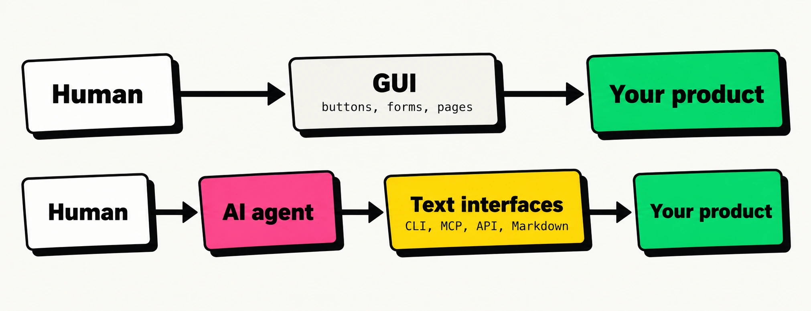
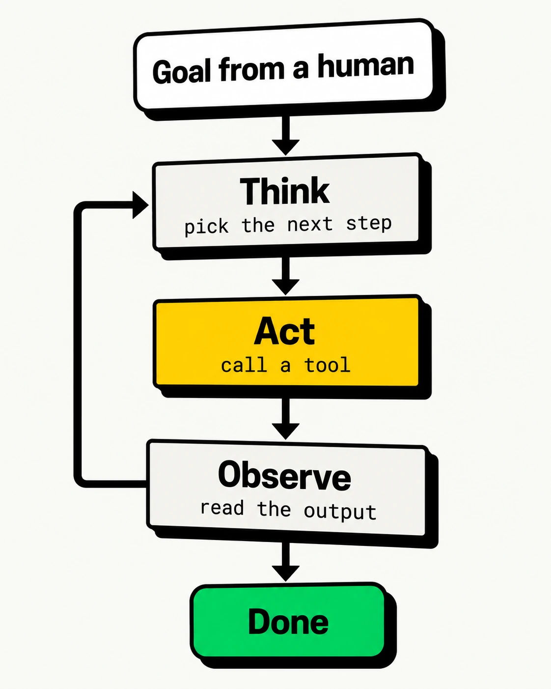
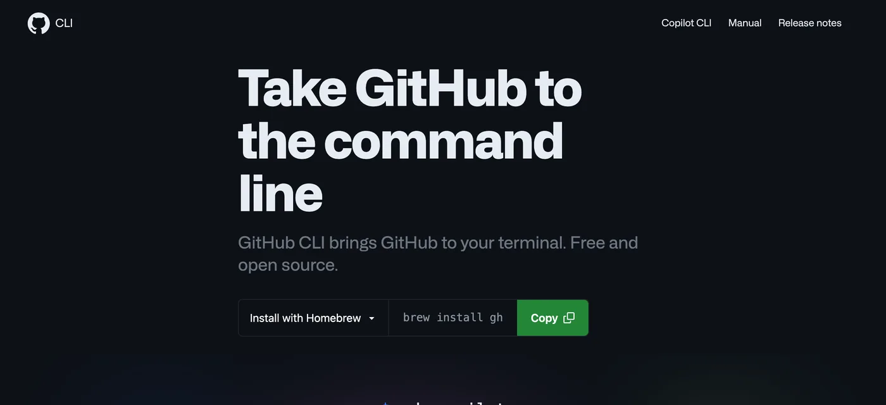
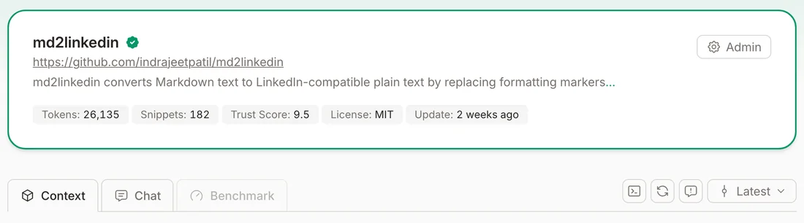
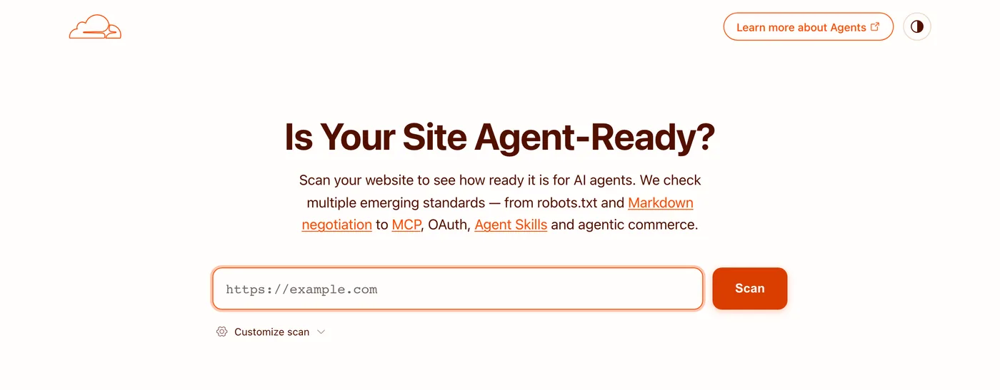
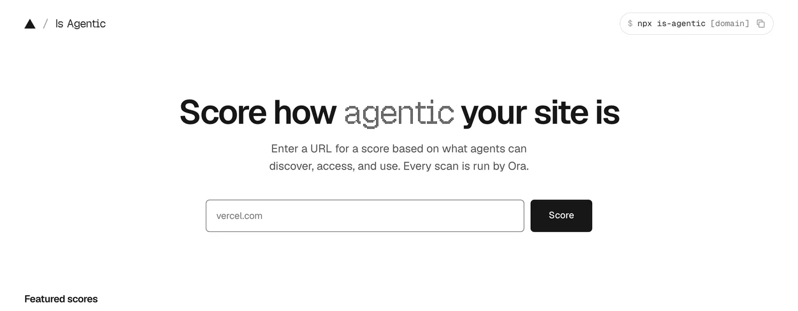
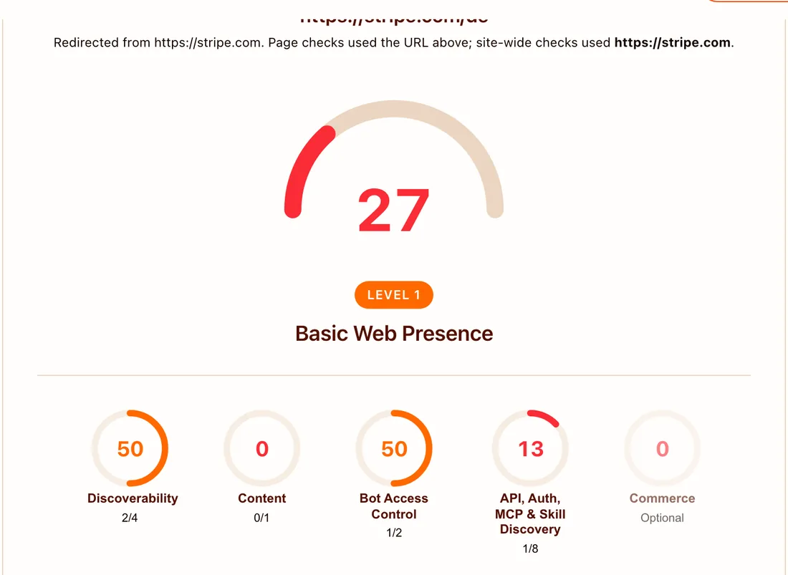
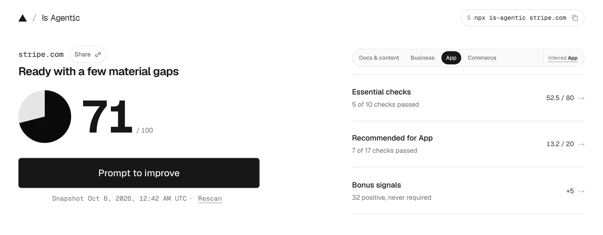
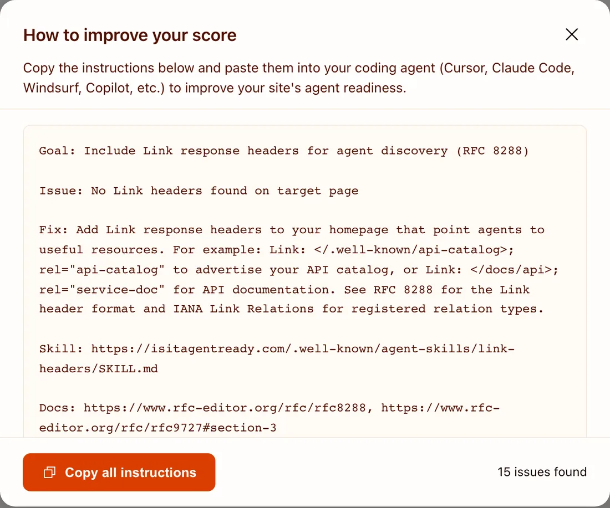
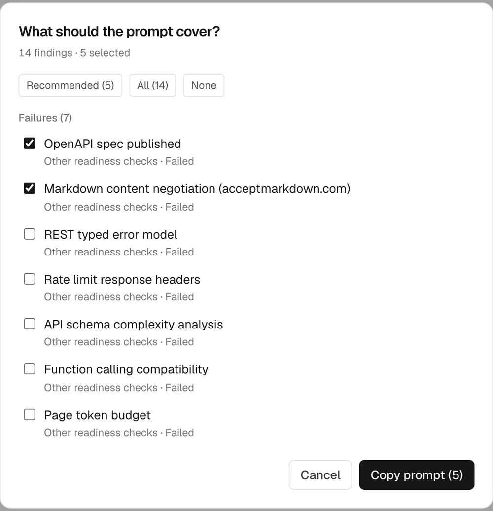

---
format:
  revealjs:
    css: style.css
    theme: simple
    revealjs-plugins:
      - a11y
    revealjs-a11y:
      # 0.2.3's menus introduce ARIA failures; retain our slide-menu handling.
      slide-menu-a11y: false
      menu: false
      # Use the extension's core accessibility fixes without extra UI/shortcuts.
      font-size-controls: false
      font-selection: false
      text-spacing: false
      transcript: false
      slide-change-cue: false
    slide-number: true
    code-line-numbers: false
    highlight-style: github
    preview-links: auto
    keyboard: true
    touch: true
    help: true
    include-in-header: meta-tags.html
    include-after-body: accessibility.html
    link-external-newwindow: true
    mermaid:
      theme: neutral
execute:
  echo: true
  eval: false
keywords: ["ai-agents", "agentic-web", "mcp", "cli", "llms-txt", "software-engineering"]
description-meta: "What it takes for software products and websites to work well with AI agents: agent-friendly CLIs, MCP servers, and websites that agents can discover, read, and trust."
license: "CC0 1.0 Universal"
pagetitle: "Building Software Products for the Agentic Age"
author-meta: "Indrajeet Patil"
date-meta: "2026-10-07"
lang: "en"
dir: "ltr"
image: "media/social-media-card.webp"
image-alt: "Title slide of a presentation about building software products for the agentic age"
canonical-url: "https://www.indrapatil.com/software-for-agentic-age/"
jupyter: python3
---

## Building Software Products for the Agentic Age {.hero .center background-color="#FFD600"}

::: {.tag}
CLI · MCP · Agentic web
:::

::: {.hero-sub}
Your next user <span class="sticker">reads text</span>, <span class="sticker amber">calls tools</span>, and <span class="sticker pink">never clicks</span>.
:::

::: {.hero-author}
Indrajeet Patil
:::

::: {.hero-source}
Source code for these slides can be found [on GitHub](https://github.com/IndrajeetPatil/software-for-agentic-age/).
:::

## What you'll learn today

::: {.grid-2}

::: {.card .cream}
::: {.card-title}
📋 We assume you know
:::

- what a large language model (LLM) is
- an **agent** is an LLM calling tools in a loop
- CLI, HTTP, and HTML basics
:::

::: {.card .yellow .tilt-r}
::: {.card-title}
🎯 You will leave with
:::

- how agents *experience* products
- products agents **act** on
- websites agents **read** and cite
- tools to measure readiness
:::

:::

::: {.callout-big}
Agent-friendliness is a new layer **on top of** good engineering, not a replacement for it.
:::

# A new kind of user {background-color="#FFD600"}

::: {.tag}
Part 0 · Foundations
:::

## Same product, new user

For decades, every user reached your product through a **screen**. Now many arrive through an **agent**.

{width="900" height="346" fig-alt="Two paths into the same product: a human uses GUI buttons, forms, and pages; another human delegates to an AI agent that uses text interfaces such as CLI, MCP, API, and Markdown."}

::: {.callout-big}
The agent is a user with **no eyes**, a **limited memory**, and **no way to answer an interactive prompt**.
:::

## How an agent works with your product

:::: {.columns}

::: {.column width="48%"}

{width="460" height="575" fig-alt="An agent starts with a goal from a human, thinks to pick the next step, acts by calling a tool, and observes the output. It loops from Observe back to Think until it is done."}

:::

::: {.column width="52%"}

::: {.card .tilt-l}
**Everything is text.** Output, errors, and docs all land in the context window.
:::

::: {.card .amber .tilt-r}
**Every token costs.** Noisy output burns money and crowds out the task.
:::

::: {.card .pink .tilt-l}
**No human in the loop.** A prompt waiting for `y/N` is a dead end.
:::

:::

::::

## Humans and agents need different things

| Need | Human user | Agent user |
|------|------------|------------|
| **Input** | Pixels on a screen | Text in a context window |
| **Navigation** | Menus, clicks, scrolling | Commands, links, tool calls |
| **Learning** | Tutorials, tooltips | `--help`, schemas, `llms.txt` |
| **Errors** | Red banner, retry button | Exit code + message it can act on |
| **Login** | Form, password, MFA prompt | Token, OAuth flow, environment variable |
| **Noise** | Mildly annoying | Costs tokens and derails the task |

::: {.callout-big}
Good news: most of what agents need is **what good engineering already recommends**.
:::

# Products agents can operate {background-color="#FFD600"}

::: {.tag}
Part 1 · CLI and MCP
:::

## Three ways in

| | HTTP API | CLI | MCP server |
|---|---|---|---|
| **Agent needs** | An HTTP client and your docs | A shell | An MCP-capable host |
| **Discovery** | OpenAPI spec, docs pages | `--help`, man pages, training data | `server/discover`, then `tools/list` returns schemas |
| **Auth** | API keys, OAuth | Token in env var, stored login | Per-user OAuth (remote) or local credentials |
| **Context cost** | Whatever docs it reads | Pay only for commands used | Tool schemas loaded up front |
| **Sweet spot** | Everything builds on it | Coding agents with a terminal | Chat apps and hosted agents with no shell |

::: {.callout-big}
CLI and MCP are **thin layers over a good API**. Get the API right first.
:::

## The command line is back

:::: {.columns}

::: {.column width="40%"}

{.photo width="340" height="302" fig-alt="A DEC VT100 computer terminal from the late 1970s showing a text-only screen"}

::: {.credit}
DEC VT100 terminal. Photo: [Jason Scott](https://commons.wikimedia.org/wiki/File:DEC_VT100_terminal.jpg), [CC BY 2.0](https://creativecommons.org/licenses/by/2.0/)
:::

:::

::: {.column width="60%"}

::: {.grid-2}

::: {.card .yellow}
::: {.card-title}
Fluent
:::
Models have read decades of shell scripts and docs.
:::

::: {.card .green}
::: {.card-title}
Composable
:::
Pipe into [`jq`](https://jqlang.org/), `grep`, and `xargs`.
:::

::: {.card .pink}
::: {.card-title}
Self-documenting
:::
`--help` is read only when needed.
:::

::: {.card .amber}
::: {.card-title}
Cheap
:::
Nothing enters context until it runs.
:::

:::

:::

::::

## Anatomy of an agent-friendly CLI

| Principle | Why agents care | Looks like |
|-----------|-----------------|------------|
| **Structured output** | Parse, don't scrape tables | `--json`, `-o json` |
| **Field selection** | Smaller output, fewer tokens | `--json name,id`, `--query` |
| **Never block on input** | No one is there to type `y` | `--yes`, `GH_PROMPT_DISABLED=1` |
| **Headless auth** | Agents can't click "Sign in" | `GH_TOKEN=…`, `az login --identity` |
| **Meaningful exit codes** | Branch on success vs failure | `0` ok, `2` bad usage, `3` not found, `4` refused |
| **Actionable errors on stderr** | Self-correct on the next turn | `error: no todo 7; run todo list` |
| **Examples in `--help`** | Learn usage on demand | `gh pr create --help` |
| **Stable, versioned output** | Scripts and agents break silently | Add fields; never rename them |

::: {.source}
Sources: [Arcjet](https://blog.arcjet.com/designing-a-cli-for-ai-agents/), [Speakeasy](https://www.speakeasy.com/blog/engineering-agent-friendly-cli), [GitHub CLI manual](https://cli.github.com/manual/gh_help_environment)
:::

## A minimal agent-friendly CLI

A toy `todo` CLI in [Typer](https://typer.tiangolo.com/). Highlights mark the agent-friendly bits.

::: {.code-sm}

```{.python filename="todo.py" code-line-numbers="4,8,13,16-17,19-20"}
from json import dumps
import typer

app = typer.Typer(rich_markup_mode=None)  # plain text: no box art for agents
TODOS = [{"id": 1, "title": "Write slides"}]

@app.command("list")
def list_todos(json: bool = typer.Option(False, "--json")):
    """Show all todos."""
    print(dumps(TODOS) if json else "\n".join(t["title"] for t in TODOS))

@app.command()
def delete(todo_id: int, yes: bool = typer.Option(False, "--yes")):
    """Delete a todo by id."""
    if todo_id not in {t["id"] for t in TODOS}:
        typer.echo(f"error: no todo {todo_id}; run `todo list`", err=True)
        raise typer.Exit(3)
    if not yes:
        typer.echo("error: deleting needs --yes", err=True)
        raise typer.Exit(4)
    print(dumps({"deleted": todo_id}))

app()
```

:::

::: {.source}
Typer turns type hints and docstrings into `--help`. Exit code `2` already means a usage error, so domain errors start at `3`. Tested with [Typer](https://typer.tiangolo.com/) 0.27.3.
:::

## The same CLI, seen by an agent

:::: {.columns}

::: {.column width="50%"}

::: {.tag}
Human mode
:::

```{.bash filename="terminal"}
$ todo list
Write slides
```

::: {.tag}
Agent mode
:::

```{.bash filename="terminal"}
$ todo list --json
[{"id": 1, "title": "Write slides"}]
```

:::

::: {.column width="50%"}

::: {.tag .red}
Failures that teach the agent
:::

```{.bash filename="terminal"}
$ todo delete 7; echo "exit $?"
error: no todo 7; run `todo list`
exit 3

$ todo delete 1; echo "exit $?"
error: deleting needs --yes
exit 4

$ todo delete 1 --yes
{"deleted": 1}
```

:::

::::

::: {.callout-big}
Each error tells the agent **what went wrong** and **what to try next**.
:::

## Exemplar: GitHub CLI (`gh`)

:::: {.columns}

::: {.column width="34%"}

{.shot width="320" height="146" fig-alt="Screenshot of the GitHub CLI home page with the headline Take GitHub to the command line"}

::: {.credit}
Screenshot of [cli.github.com](https://cli.github.com/), 7 Oct 2026
:::

::: {.card .yellow .tilt-l}
- `--json` + `--jq` almost everywhere
- `GH_TOKEN` for headless auth
- `GH_PROMPT_DISABLED` stops prompts
:::

:::

::: {.column width="66%"}

```{.bash filename="terminal"}
# Ask for exactly the fields you need
$ gh pr list --repo cli/cli --limit 3 \
    --json number,author \
    --jq '.[] | "\(.number) \(.author.login)"'
14620 williammartin
14617 bingtang9
14583 BagToad

# Escape hatch: any REST endpoint, authenticated
$ gh api repos/cli/cli --jq '.license.spdx_id'
MIT
```

:::

::::

::: {.source}
Source: [GitHub CLI manual](https://cli.github.com/manual/)
:::

## Exemplar: Azure CLI (`az`)

:::: {.columns}

::: {.column width="62%"}

```{.bash filename="terminal"}
# JMESPath query + TSV output: values only, no table art
$ az vm list --show-details \
    --query "[?powerState=='VM running'].name" -o tsv

# No confirmation prompt, no waiting on a long operation
$ az group delete --name rg-demo --yes --no-wait

# Headless sign-in with a managed identity
$ az login --identity

# Escape hatch: any Azure REST API, already authenticated
$ az rest --method get --url "<management-endpoint>"
```

:::

::: {.column width="38%"}

::: {.card .green .tilt-r}
- `--query` filters *before* output
- `-o json`, `tsv`, or `table` everywhere
- `--yes`, `--no-wait` for unattended runs
:::

:::

::::

::: {.callout-big}
Pattern: **human-friendly by default, machine-friendly by flag**, with the full API one command away.
:::

::: {.source}
Sources: [Azure CLI: query output with JMESPath](https://learn.microsoft.com/en-us/cli/azure/query-azure-cli), [Azure MCP Server overview](https://learn.microsoft.com/en-us/azure/developer/azure-mcp-server/overview)
:::

## What is MCP?

The **Model Context Protocol** is an open standard for plugging tools and data into any agent host. Current spec: <span class="sticker yellow">2026-07-28</span>

```{mermaid}
%%| eval: true
%%| echo: false
%%{init: {"htmlLabels": false, "flowchart": {"htmlLabels": false, "padding": 16}, "themeVariables": {"fontFamily": "Space Grotesk, sans-serif", "fontSize": "20px"}}}%%
flowchart LR
    subgraph Host["Agent host"]
        M[LLM] <--> C[MCP client]
    end
    C <-- "server/discover<br/>tools/list<br/>tools/call" --> S[Your MCP server]
    S <--> API[Your API]

    classDef box fill:#ffffff,stroke:#0a0a0a,stroke-width:3px,color:#0a0a0a
    classDef yours fill:#ffd600,stroke:#0a0a0a,stroke-width:3px,color:#0a0a0a
    class M,C box
    class S,API yours
    style Host fill:#f5f5f0,stroke:#0a0a0a,stroke-width:3px,color:#0a0a0a
```

::: {.grid-3}

::: {.card .yellow}
**Tools**: actions the model can call
:::

::: {.card .green}
**Resources**: data the app can read
:::

::: {.card .pink}
**Prompts**: templates the user can pick
:::

:::

::: {.source}
Source: [MCP specification 2026-07-28](https://modelcontextprotocol.io/specification/2026-07-28)
:::

## A minimal MCP server

:::: {.columns}

::: {.column width="52%"}

::: {.code-sm}

```{.python filename="server.py: you write"}
from mcp.server import MCPServer

mcp = MCPServer("Todo")


@mcp.tool()
def add_todo(
    title: str, due: str | None = None
) -> dict:
    """Create a todo. due: ISO date."""
    return {"id": 42, "title": title}


if __name__ == "__main__":
    mcp.run("streamable-http")
```

:::

:::

::: {.column width="48%"}

::: {.code-sm}

```{.json filename="tools/list: the agent sees"}
{
  "name": "add_todo",
  "description": "Create a todo. due: ISO date.",
  "inputSchema": {
    "type": "object",
    "properties": {
      "title": {"type": "string"},
      "due": {"anyOf": [{"type": "string"},
                        {"type": "null"}]}
    },
    "required": ["title"]
  }
}
```

:::

:::

::::

::: {.callout-big}
Type hints and docstrings **become the interface**. Write them for a reader with no context.
:::

::: {.source}
Tested with the [MCP Python SDK](https://py.sdk.modelcontextprotocol.io/v2/) 2.3.0, which speaks protocol 2026-07-28; schema output abridged.
:::

## Every request stands alone

:::: {.columns}

::: {.column width="58%"}

::: {.code-sm}

```{.json filename="POST /mcp: the whole conversation"}
{
  "jsonrpc": "2.0",
  "id": 1,
  "method": "tools/call",
  "params": {
    "name": "add_todo",
    "arguments": {"title": "Write slides"},
    "_meta": {
      "io.modelcontextprotocol/protocolVersion":
        "2026-07-28",
      "io.modelcontextprotocol/clientCapabilities":
        {}
    }
  }
}
```

:::

:::

::: {.column width="42%"}

::: {.code-sm}

```{.json filename="200 OK: the result"}
{
  "jsonrpc": "2.0",
  "id": 1,
  "result": {
    "resultType": "complete",
    "content": [{
      "type": "text",
      "text": "{\"id\": 42, ...}"
    }],
    "isError": false
  }
}
```

:::

::: {.card .yellow style="font-size: 0.7em;"}
Each request carries everything the server needs, so any replica can answer: MCP servers **scale and cache like any HTTP API**.
:::

:::

::::

::: {.source}
Sent with [curl](https://curl.se/) to the minimal `server.py` from the previous slide ([MCP Python SDK](https://py.sdk.modelcontextprotocol.io/v2/) 2.3.0); response abridged.
:::

## CLI or MCP?

::: {.grid-2}

::: {.card .yellow .tilt-l}
::: {.card-title}
Prefer a CLI when
:::

- the agent has a terminal (coding agents)
- one developer, their own credentials
- output needs piping and scripting
- humans use the same tool
:::

::: {.card .green .tilt-r}
::: {.card-title}
Prefer MCP when
:::

- the agent has no shell (chat apps)
- many users need per-user OAuth
- you need central governance and audit
- you want hosted, zero-install access
:::

:::

::: {style="text-align: center; font-size: 0.8em; margin-top: 0.6em;"}
Same GitHub question, Claude Sonnet 4: <span class="sticker green">CLI 1,365 tokens</span> vs <span class="sticker pink">MCP 44,026 tokens</span>
:::

::: {.source}
Source: [Scalekit benchmark](https://www.scalekit.com/blog/mcp-vs-cli-use) (Mar 2026), 43 tool schemas loaded up front. Most of the gap is schema overhead, not the protocol.
:::

## Design beats protocol

A naive MCP server exposes one tool per endpoint. Cloudflare's API has **2,500+** endpoints.

::: {.grid-2}

::: {.card .red .stat}
<span class="num">~1.17M</span>
<span class="label">tokens: one tool per endpoint</span>
:::

::: {.card .green .stat}
<span class="num">~1,000</span>
<span class="label">tokens: two tools, search() + execute()</span>
:::

:::

::: {.callout-big}
Expose **few, well-described tools**. Let the agent search for detail on demand.
:::

::: {.source}
Source: Cloudflare, [Code Mode: give agents an entire API in 1,000 tokens](https://blog.cloudflare.com/code-mode-mcp/)
:::

## Who does this well?

| Company | CLI | MCP server | Docs agents can read |
|---------|-----|------------|----------------------|
| **GitHub** | [`gh`](https://cli.github.com/) with `--json`, `--jq`, `gh api` | [GitHub MCP Server](https://github.com/github/github-mcp-server), local and remote | Markdown docs |
| **Microsoft Azure** | [`az`](https://learn.microsoft.com/en-us/cli/azure/) with `--query`, `-o tsv`, `az rest` | [Azure MCP Server](https://github.com/microsoft/mcp) | [Microsoft Learn MCP](https://learn.microsoft.com/en-us/training/support/mcp) |
| **Stripe** | [`stripe` CLI](https://docs.stripe.com/stripe-cli) | Remote MCP at `mcp.stripe.com` | [`docs.stripe.com/llms.txt`](https://docs.stripe.com/llms.txt) |
| **Cloudflare** | [`wrangler`](https://developers.cloudflare.com/workers/wrangler/) | [Code Mode MCP](https://blog.cloudflare.com/code-mode-mcp/) for the whole API | [Markdown for Agents](https://blog.cloudflare.com/markdown-for-agents/), `llms.txt` |
| **Vercel** | [`vercel` CLI](https://vercel.com/docs/cli) | Remote MCP at `mcp.vercel.com` | Markdown via [content negotiation](https://vercel.com/blog/making-agent-friendly-pages-with-content-negotiation) |

::: {.callout-big}
The leaders ship **all three interfaces**: API, CLI *and* MCP, plus docs that agents can read.
:::

## Teach the agent: ship a skill

:::: {.columns}

::: {.column width="55%"}

```{.markdown filename="skills/todo-cli/SKILL.md"}
---
name: todo-cli
description: Manage todos with the `todo` CLI.
  Use when asked to list or delete todos.
---

# Using the todo CLI

- Always pass `--json` and parse stdout.
- Exit code 3 means "not found":
  run `todo list` to get valid ids.
- Deleting needs `--yes`; ask the user first.
```

:::

::: {.column width="45%"}

::: {.card .yellow .tilt-r}
**Agent Skills** are folders of instructions an agent loads **only when relevant**.
:::

::: {.card .cream}
Only the `name` and `description` sit in context until the skill is triggered.
:::

::: {.card .green .tilt-l}
`AGENTS.md` does the same job for a **repository**.
:::

:::

::::

::: {.source}
Sources: [agentskills.io](https://agentskills.io/), [agents.md](https://agents.md/)
:::

## Packages: docs agents can fetch

Coding agents read your docs, in **Markdown**, before they call your code.

| File | What it holds | md2linkedin |
|------|---------------|-------------|
| `/llms.txt` | Summary plus curated links to Markdown pages | 0.7 KB |
| `/llms-full.txt` | Every docs page concatenated into one file | 33 KB |
| `/<page>/index.md` | A Markdown twin of each HTML page | 6 KB vs 39 KB HTML |
| `<link>` tag | `rel="alternate"` points crawlers at the `.md` twin | In every `<head>` |

::: {.callout-big}
`llms.txt` to **navigate**, `.md` pages to **read one topic**, `llms-full.txt` to **load everything**.
:::

::: {.card .amber style="font-size: 0.7em;"}
**Hype check:** Google says AI search needs no `llms.txt`, but it's cheap and [Lighthouse](https://developer.chrome.com/docs/lighthouse/overview) checks it. Start it with a **"When to use this"** line.
:::

::: {.source}
Sizes from [indrapatil.com/md2linkedin](https://www.indrapatil.com/md2linkedin/), 7 Oct 2026. `/.well-known/` copies count only at the domain root ([RFC 8615](https://www.rfc-editor.org/rfc/rfc8615)). Sources: [llmstxt.org](https://llmstxt.org/), [Google](https://developers.google.com/search/docs/appearance/ai-features), [Lighthouse](https://developer.chrome.com/docs/lighthouse/agentic-browsing/llms-txt).
:::

## Generate them at build time

:::: {.columns}

::: {.column width="50%"}

::: {.code-sm}

```{.yaml filename="mkdocs.yml: you write"}
plugins:
  - llmstxt:
      full_output: llms-full.txt
      markdown_description: |-
        md2linkedin is a Python library and
        CLI tool that converts Markdown ...
      sections:
        Home documentation:
          - index.md
        API documentation:
          - reference/*.md
```

:::

:::

::: {.column width="50%"}

::: {.code-sm}

```{.markdown filename="llms.txt: the build writes"}
# md2linkedin

> Convert Markdown to LinkedIn-friendly
> Unicode text

md2linkedin is a Python library and ...

## Home documentation

- [Home](https://www.indrapatil.com/
  md2linkedin/index.md)

## API documentation

- [Converter](https://www.indrapatil.com/
  md2linkedin/reference/converter/index.md)
```

:::

:::

::::

::: {.grid-2}

::: {.card .yellow .tilt-l}
**Python:** the [`llmstxt` plugin](https://github.com/pawamoy/mkdocs-llmstxt) for [MkDocs](https://www.mkdocs.org/), built into [Zensical](https://zensical.org/) since 0.0.67
:::

::: {.card .green .tilt-r}
**R:** [pkgdown](https://pkgdown.r-lib.org/) 2.2.0+ writes `llms.txt` and a `.md` for every page by default
:::

:::

::: {.source}
Abridged from [md2linkedin](https://github.com/IndrajeetPatil/md2linkedin) (long lines wrapped). Sources: [mkdocs-llmstxt](https://github.com/pawamoy/mkdocs-llmstxt), [Zensical plugins](https://zensical.org/docs/compatibility/mkdocs/plugins/), [pkgdown `build_llm_docs()`](https://pkgdown.r-lib.org/reference/build_llm_docs.html)
:::

## Get indexed by Context7

{.shot width="680" height="189" fig-alt="Context7 page for md2linkedin showing 26,135 tokens, 182 snippets, trust score 9.5, MIT licence"}

::: {.credit}
Screenshot of [context7.com/indrajeetpatil/md2linkedin](https://context7.com/indrajeetpatil/md2linkedin), 7 Oct 2026
:::

::: {.grid-2}

::: {.card .yellow .tilt-l}
**Add** your repo at [context7.com](https://context7.com/) and steer the parser with `context7.json`. **Agents** then call `resolve-library-id` and `query-docs` over MCP.
:::

::: {.code-sm}

```{.bash filename="what the agent gets back"}
# query-docs("/indrajeetpatil/md2linkedin",
#   "convert a markdown file from the CLI")
# → "Convert Markdown using CLI" (README.md)
md2linkedin post.md -o linkedin_post.txt
echo "**Hello**, *world*!" | md2linkedin
md2linkedin post.md --preserve-links
```

:::

:::

::: {.source}
Sources: [Context7](https://context7.com/), [Adding libraries](https://context7.com/docs/adding-libraries) and [Library owners](https://context7.com/docs/library-owners). Output abridged from a live query on 7 Oct 2026.
:::

## Context7 as a docs quality check

::: {.grid-3}

::: {.card .yellow .stat .tilt-l}
<span class="num">182</span>
<span class="label">code snippets extracted</span>
:::

::: {.card .green .stat}
<span class="num">26,135</span>
<span class="label">tokens of docs indexed</span>
:::

::: {.card .pink .stat .tilt-r}
<span class="num">9.5</span>
<span class="label">trust score</span>
:::

:::

| Signal | What it tells you |
|--------|-------------------|
| **Snippets** | How many runnable examples an agent can copy. Few snippets means few examples. |
| **Benchmark** | LLMs ask the questions developers ask, answer from your docs, and a jury scores the answers. |
| **Trust score** | Organisation signals: age, stars, followers, contributors, referrals. |

::: {.callout-big}
Ask Context7 your users' top five questions. If the snippets can't answer them, **neither can an agent**.
:::

::: {.source}
Source: Upstash, [Inside Context7's quality stack](https://upstash.com/blog/context7-quality). [md2linkedin](https://github.com/IndrajeetPatil/md2linkedin) had no benchmark score yet on 7 Oct 2026; scores are LLM-judged, so treat them as a guide.
:::

## Agents act with your users' credentials

::: {.grid-2}

::: {.card .yellow}
::: {.card-title}
🔑 Least privilege
:::
Fine-grained, scoped, short-lived tokens. Read-only by default.
:::

::: {.card .amber}
::: {.card-title}
🧪 Dry runs
:::
`--dry-run` and plan/apply split for anything destructive.
:::

::: {.card .pink}
::: {.card-title}
🛑 Explicit consent
:::
Destructive actions need an explicit flag, never a default.
:::

::: {.card .green}
::: {.card-title}
🧾 Audit trail
:::
Identify agent traffic and log every action it takes.
:::

:::

::: {.callout-big}
Treat tool output as **untrusted input**: text in the data can carry instructions that hijack the agent (prompt injection).
:::

# Websites agents can read {background-color="#FFD600"}

::: {.tag}
Part 2 · The agentic web
:::

## The web was built for people with browsers

:::: {.columns}

::: {.column width="48%"}

{.photo width="420" height="315" fig-alt="The NeXT computer used by Tim Berners-Lee as the first web server, on display at CERN"}

::: {.credit}
The first web server, CERN. Photo: [Coolcaesar](https://commons.wikimedia.org/wiki/File:First_Web_Server.jpg), [CC BY-SA 3.0](https://creativecommons.org/licenses/by-sa/3.0/)
:::

:::

::: {.column width="52%"}

::: {.card .pink .stat .tilt-r}
<span class="num">&lt; 50%</span>
<span class="label">of HTML page requests now come from a human</span>
:::

::: {.card .cream}
Search crawlers, AI crawlers, and agents now read your pages **more often than people do**.
:::

:::

::::

::: {.source}
Source: Cloudflare, [From ranking to recommended](https://blog.cloudflare.com/aeo/) (Aug 2026)
:::

## Who are the machine visitors?

| Visitor | Example user agents | What it wants | When |
|---------|---------------------|---------------|------|
| **Search crawler** | `Googlebot`, `OAI-SearchBot`, `Claude-SearchBot` | Index pages for search results | Continuously |
| **Training crawler** | `GPTBot`, `ClaudeBot`, `CCBot` | Content for training models | Periodically |
| **User-directed fetcher** | `ChatGPT-User`, `Claude-User`, `Perplexity-User` | Answer one person's question now | On demand |
| **Browser agent** | Agents driving Chrome or a headless browser | Click and type on a user's behalf | On demand |

::: {.callout-big}
Each group can be **allowed or refused separately**. That choice is yours.
:::

::: {.source}
`Google-Extended` is a robots.txt control token for Gemini training, not a separate crawler. Sources: [OpenAI](https://platform.openai.com/docs/bots), [Anthropic](https://support.claude.com/en/articles/8896518-does-anthropic-crawl-data-from-the-web-and-how-can-site-owners-block-the-crawler), [Google](https://developers.google.com/search/docs/crawling-indexing/google-common-crawlers)
:::

## Participation is a choice

::: {.grid-3}

::: {.card .cream .tilt-l}
::: {.card-title}
🚫 Opt out
:::

```{.default filename="robots.txt"}
User-agent: GPTBot
User-agent: ClaudeBot
User-agent: CCBot
Disallow: /
```
:::

::: {.card .yellow}
::: {.card-title}
⚖️ Search, no training
:::

```{.default filename="robots.txt"}
User-agent: *
Allow: /
Content-Signal: search=yes,
  ai-input=yes, ai-train=no
```
:::

::: {.card .green .tilt-r}
::: {.card-title}
✅ All in
:::

```{.default filename="robots.txt"}
User-agent: *
Allow: /
Content-Signal: search=yes,
  ai-input=yes, ai-train=yes
```
:::

:::

::: {.callout-big}
Not taking part is **completely legitimate**. Pick deliberately, then make the signals match.
:::

::: {.source}
`robots.txt` is a request, not a lock: enforce with bot management or a WAF. Content-Signal values must sit on one line in a real file. Source: [contentsignals.org](https://contentsignals.org/)
:::

## The old rules still apply

::: {.pyramid}

::: {.layer .l4}
Agent extras: `llms.txt`, Markdown, MCP
:::

::: {.layer .l3}
Structured data and metadata
:::

::: {.layer .l2}
SEO: crawlable, titled, described, in a sitemap
:::

::: {.layer .l1}
Fast, accessible, semantic HTML over HTTPS
:::

:::

::: {.grid-2}

::: {.card .cream}
> "All existing SEO fundamentals continue to be worthwhile."

Google Search Central
:::

::: {.card .cream}
> "Agents review the accessibility tree to identify interactive elements."

Chrome Lighthouse docs
:::

:::

::: {.source}
Sources: [Google: AI features and your website](https://developers.google.com/search/docs/appearance/ai-features), [Chrome: accessibility for agents](https://developer.chrome.com/docs/lighthouse/agentic-browsing/accessibility-for-agents)
:::

## A ladder, not a checklist

::: {.ladder}

::: {.step .s0}
[LEVEL 0]{.lvl}
[Foundations]{.name}
SEO, accessibility, performance, HTTPS
:::

::: {.step .s1}
[LEVEL 1]{.lvl}
[Discoverable]{.name}
`robots.txt` stance, sitemap, content signals
:::

::: {.step .s2}
[LEVEL 2]{.lvl}
[Readable]{.name}
Server-rendered HTML, Markdown, `llms.txt`
:::

::: {.step .s3}
[LEVEL 3]{.lvl}
[Trustworthy]{.name}
Structured data, trust pages, honest status codes
:::

::: {.step .s4}
[LEVEL 4]{.lvl}
[Operable]{.name}
API catalogue, OAuth, MCP, WebMCP
:::

:::

::: {.callout-big}
Climb only as high as your site needs. **Personal sites can stop at level 3.**
:::

## Level 1: be discoverable

:::: {.columns}

::: {.column width="55%"}

::: {.code-sm}

```{.default filename="robots.txt"}
User-agent: *
Allow: /
Content-Signal: search=yes, ai-input=yes, ai-train=no

# Name AI crawlers so intent is explicit
User-agent: GPTBot
User-agent: ClaudeBot
Allow: /
Content-Signal: search=yes, ai-input=yes, ai-train=no

Sitemap: https://example.com/sitemap.xml
```

:::

:::

::: {.column width="45%"}

::: {.card .yellow .tilt-r}
Crawlers obey only their **most specific group**, so repeat directives in every named group.
:::

::: {.card .cream .tilt-l}
`robots.txt` sits on **78%** of top sites; content signals on just **4%**.
:::

:::

::::

::: {.source}
Source: Cloudflare, [Introducing the Agent Readiness score](https://blog.cloudflare.com/agent-readiness/) (Apr 2026)
:::

## Level 2: put content in the HTML

::: {.grid-2}

::: {.card .red}
::: {.card-title}
❌ Client-rendered shell
:::

```{.html}
<body>
  <div id="root"></div>
  <script src="/app.js"></script>
</body>
```

Many fetchers never run JavaScript, so they see **nothing**.
:::

::: {.card .green}
::: {.card-title}
✅ Server-rendered page
:::

```{.html}
<body>
  <main>
    <h1>Pricing</h1>
    <p>Pro plan: $20 per month.</p>
  </main>
</body>
```

The answer is in the **first response**.
:::

:::

```{.bash filename="terminal"}
# What does an agent see? Expect a 200 and your answer in the HTML.
curl -iL -A 'Claude-User/1.0' https://example.com/pricing
```

::: {.source}
Source: Vercel, [Make your site readable by AI agents](https://vercel.com/kb/guide/make-your-site-readable-by-ai-agents)
:::

## Level 2: serve Markdown to agents

```{.bash filename="terminal"}
$ curl -sI -H 'Accept: text/markdown' \
    https://vercel.com/blog/making-agent-friendly-pages-with-content-negotiation
content-type: text/markdown; charset=utf-8
vary: Accept
```

::: {.grid-2}

::: {.card .yellow .stat .tilt-l}
<span class="num">645 → 7 KB</span>
<span class="label">Vercel blog post, HTML vs Markdown</span>
:::

::: {.card .green .stat .tilt-r}
<span class="num">179 → 17 KB</span>
<span class="label">Cloudflare docs page, HTML vs Markdown</span>
:::

:::

::: {.callout-big}
Can't negotiate? Publish `.md` mirrors and link them with `<link rel="alternate" type="text/markdown">`.
:::

::: {.source}
Measured with [curl](https://curl.se/) on 7 Oct 2026. See Vercel, [content negotiation](https://vercel.com/blog/making-agent-friendly-pages-with-content-negotiation), and Cloudflare, [Markdown for Agents](https://blog.cloudflare.com/markdown-for-agents/).
:::

## Level 3: say who you are, in data

:::: {.columns}

::: {.column width="55%"}

```{.html filename="index.html"}
<html lang="en-GB">
<head>
  <title>Jane Doe, data engineer</title>
  <meta name="description" content="...">
  <link rel="canonical" href="https://jane.dev/">
  <script type="application/ld+json">
  {
    "@context": "https://schema.org",
    "@type": "ProfilePage",
    "mainEntity": {
      "@type": "Person",
      "name": "Jane Doe",
      "sameAs": ["https://github.com/janedoe"]
    }
  }
  </script>
</head>
```

:::

::: {.column width="45%"}

| Signal | Keep it |
|--------|---------|
| `<title>`, description | Unique per page |
| Canonical URL | Exactly what is served |
| `lang`, `og:locale` | Consistent everywhere |
| JSON-LD type | Honest: no fake FAQs |
| Dates | Real changes only |

:::

::::

::: {.source}
Source: [schema.org](https://schema.org/ProfilePage). Mismatched locale or canonical signals confuse crawlers and retrieval alike.
:::

## Level 3: earn the agent's trust

::: {.grid-2}

::: {.card .yellow .tilt-l}
::: {.card-title}
🪪 Trust pages
:::
Real **About**, **Contact**, and **Privacy** pages, with substance, linked from every footer.
:::

::: {.card .green .tilt-r}
::: {.card-title}
🔢 Honest status codes
:::
`404` for missing pages, not a `200` app shell. `429` with `Retry-After` when throttling.
:::

::: {.card .pink .tilt-r}
::: {.card-title}
🧭 Helpful 404s
:::
Point lost agents to the sitemap, `llms.txt`, and the About page.
:::

::: {.card .cream .tilt-l}
::: {.card-title}
🔒 Accurate privacy
:::
Describe the analytics you actually run. Agents quote you.
:::

:::

::: {.source}
Sources: Vercel, [Make your site readable by AI agents](https://vercel.com/kb/guide/make-your-site-readable-by-ai-agents); [is-agentic.com methodology](https://is-agentic.com/methodology)
:::

## Level 4: advertise what agents can do

| Signal | Location | Publish only if… |
|--------|----------|------------------|
| **API catalogue** (RFC 9727) | `/.well-known/api-catalog` | You have a public API |
| **OpenAPI spec** | e.g. `/openapi.json` | You have a public API |
| **OAuth discovery** | `/.well-known/oauth-authorization-server` | Agents must sign in |
| **MCP Server Card** | `/.well-known/mcp/server-card.json` | You run an MCP server |
| **Agent Skills index** | `/.well-known/agent-skills/index.json` | You have tasks worth teaching |
| **Agentic commerce** | x402, ACP, UCP | Agents can buy from you |

::: {.callout-big}
Never advertise a capability you don't have. A **false signal is worse than none**.
:::

::: {.source}
Source: Cloudflare, [isitagentready.com](https://isitagentready.com/) check list
:::

## Level 4: WebMCP, tools inside the page

:::: {.columns}

::: {.column width="58%"}

```{.html filename="search.html"}
<form toolname="search_flights"
      tooldescription="Search flights by route and date">
  <input name="origin" required>
  <input name="destination" required>
  <input name="date" type="date" required>
  <button>Search</button>
</form>
```

:::

::: {.column width="42%"}

::: {.card .pink .tilt-r}
::: {.tag}
Experimental
:::

A browser agent calls `search_flights` directly instead of guessing which box to type in.
:::

::: {.card .cream}
[WebMCP](https://github.com/webmachinelearning/webmcp) is a Chrome origin trial; API names are still changing. **Watch, don't bet the roadmap.**
:::

:::

::::

::: {.source}
Source: Chrome, [WebMCP schema validity audit](https://developer.chrome.com/docs/lighthouse/agentic-browsing/webmcp-schema-validity)
:::

## Your host decides some of this

| Capability | Static host (e.g. GitHub Pages) | Programmable edge (Cloudflare, Vercel, Netlify) |
|------------|:-------------------------------:|:-----------------------------------------------:|
| `robots.txt`, sitemap, `llms.txt` | ✅ | ✅ |
| `.md` mirrors + `<link rel="alternate">` | ✅ | ✅ |
| `Link` response headers (RFC 8288) | ❌ fixed headers | ✅ |
| `Accept: text/markdown` negotiation | ❌ | ✅ toggle or rewrite rule |
| Bot management, enforced blocking | ❌ | ✅ |

::: {.callout-big}
Some failing checks are **hosting decisions, not code bugs**. Use the static substitutes and move on.
:::

## Personal vs commercial sites

| | Personal, non-commercial | Commercial |
|---|---|---|
| **Goal** | Be found and cited correctly | Be found, recommended, and *used* |
| **Must** | Levels 0–1, server-rendered HTML | Levels 0–3 everywhere |
| **Worth it** | `llms.txt`, `.md` mirrors, `Person` JSON-LD, trust pages | Markdown negotiation, OpenAPI, CLI, MCP, OAuth |
| **Skip** | API catalogue, OAuth, MCP card, WebMCP: nothing to call | Signals for features you don't offer |
| **Track** | Search Console, an occasional scan | Citation rate and share of voice in AI answers |

::: {.callout-big}
Size the effort to the site. **If visitors can't *do* anything there, skip the API layer.**
:::

::: {.source}
Source for answer-engine metrics: Cloudflare, [From ranking to recommended](https://blog.cloudflare.com/aeo/)
:::

# Measure and iterate {background-color="#FFD600"}

::: {.tag}
Part 3 · Tools
:::

## Paste a URL, get a score

:::: {.columns}

::: {.column width="50%"}

{.shot width="470" height="184" fig-alt="Screenshot of isitagentready.com asking Is Your Site Agent-Ready with a URL box and a Scan button"}

::: {.credit}
[isitagentready.com](https://isitagentready.com/) by Cloudflare, 7 Oct 2026
:::

::: {.card .amber}
Discoverability, content, bot access, protocol discovery, and (unscored) commerce
:::

:::

::: {.column width="50%"}

{.shot width="470" height="184" fig-alt="Screenshot of is-agentic.com with the headline Score how agentic your site is and a URL box"}

::: {.credit}
[is-agentic.com](https://is-agentic.com/) by Vercel, 7 Oct 2026
:::

::: {.card .yellow}
100+ checks, scored 0–100, with a web UI, CLI, API **and** MCP server
:::

:::

::::

## Same site, two very different scores

:::: {.columns}

::: {.column width="45%"}

{.shot width="400" height="292" fig-alt="isitagentready.com report for stripe.com: score 27, Level 1 Basic Web Presence"}

::: {.credit}
stripe.com on [isitagentready.com](https://isitagentready.com/stripe.com), 7 Oct 2026
:::

:::

::: {.column width="55%"}

{.shot width="500" height="195" fig-alt="is-agentic.com report for stripe.com: 71 out of 100, Ready with a few material gaps"}

::: {.credit}
stripe.com on [is-agentic.com](https://is-agentic.com/scan/stripe.com), 7 Oct 2026
:::

::: {.callout-big}
**27** vs **71**. Scanners are opinionated checklists, so read the findings, not the number.
:::

:::

::::

## From findings to a prompt

:::: {.columns}

::: {.column width="50%"}

{.shot width="440" height="367" fig-alt="isitagentready.com dialog How to improve your score with instructions to paste into a coding agent"}

::: {.credit}
[isitagentready.com](https://isitagentready.com/): "Improve the score"
:::

:::

::: {.column width="50%"}

{.shot width="360" height="373" fig-alt="is-agentic.com dialog asking What should the prompt cover with a list of failed checks to select"}

::: {.credit}
[is-agentic.com](https://is-agentic.com/): "Prompt to improve"
:::

:::

::::

::: {.callout-big}
Both tools turn failures into **a prompt for your coding agent**. Review the diff like any other PR.
:::

## Scan from the terminal and CI

```{.bash filename="terminal"}
# Vercel's Is Agentic scanner, from the command line
npx is-agentic example.com --json

# Or read a stored report over HTTP
curl -s 'https://is-agentic.com/api/v1/report?url=example.com'

# Fail CI when agent readability drops below a threshold
npx @vercel/agent-readability audit https://example.com --min-score 80
```

::: {.grid-2}

::: {.card .yellow .tilt-l}
Chrome **[Lighthouse](https://developer.chrome.com/docs/lighthouse/overview)** has an experimental *Agentic Browsing* category: accessibility tree, layout shift, `llms.txt`, WebMCP.
:::

::: {.card .green .tilt-r}
The scanners **practise what they preach**: they offer CLIs, APIs, and MCP servers of their own.
:::

:::

::: {.source}
Sources: [Vercel KB](https://vercel.com/kb/guide/make-your-site-readable-by-ai-agents), [@vercel/agent-readability](https://www.npmjs.com/package/@vercel/agent-readability), [Lighthouse agentic browsing](https://developer.chrome.com/docs/lighthouse/agentic-browsing/scoring)
:::

## Most of the web isn't there yet

Adoption among [Cloudflare Radar](https://radar.cloudflare.com/)'s top 200,000 domains, Apr 2026:

```{=html}
<div class="bars" role="img" aria-label="Bar chart: robots.txt present on 78% of sites, Content Signals on 4%, Markdown negotiation on 3.9%, MCP Server Cards on fewer than 15 sites">
  <span><code>robots.txt</code> present</span><span class="track"><span class="fill" style="width: 78%;"></span></span><span class="val">78%</span>
  <span>Content Signals</span><span class="track"><span class="fill" style="width: 4%;"></span></span><span class="val">4%</span>
  <span>Markdown negotiation</span><span class="track"><span class="fill" style="width: 3.9%;"></span></span><span class="val">3.9%</span>
  <span>MCP Server Card</span><span class="track"><span class="fill" style="width: 0%;"></span></span><span class="val">&lt;15 sites</span>
</div>
```

::: {.callout-big}
Most sites stop at `robots.txt`. **A few small changes already put you ahead.**
:::

::: {.source}
Source: Cloudflare, [Introducing the Agent Readiness score](https://blog.cloudflare.com/agent-readiness/)
:::

# Wrapping up {background-color="#FFD600"}

::: {.tag}
Recap
:::

## Where to start

| When | Product (CLI, MCP) | Website |
|------|--------------------|---------|
| **This week** | Add `--json` and non-interactive flags; fix exit codes | Decide your AI stance; update `robots.txt` and the sitemap |
| **This month** | Headless auth with scoped tokens; `llms.txt` for your docs | Server-render key pages; add `llms.txt` and `.md` mirrors |
| **This quarter** | Ship a small MCP server and a skill; get indexed by Context7 | Structured data, trust pages, Markdown negotiation |
| **Always** | Version the output; never rename fields | Keep SEO, accessibility, and performance healthy |

::: {.callout-big}
Run a scanner **before and after**. Fix what matters for *your* users.
:::

## Key takeaways

::: {.grid-2}

::: {.card .yellow .tilt-l}
**1.** Agents are users with no eyes and finite memory. Design for **text and tokens**.
:::

::: {.card .green .tilt-r}
**2.** A great **API + CLI + MCP** trio lets agents operate your product.
:::

::: {.card .pink .tilt-r}
**3.** For the web, **SEO and accessibility still come first**. Agent extras build on them.
:::

::: {.card .amber .tilt-l}
**4.** Opting out is fine. Whatever you choose, **send honest, consistent signals**.
:::

:::

::: {.callout-big}
Build for humans *and* agents: the overlap is just **good engineering**.
:::

# Thank You {background-color="#FFD600"}

And happy building! 🤖

<br>

::: {style="text-align: center; font-size: 0.7em;"}

Check out my other [slide decks](https://www.indrapatil.com/presentations/) on software development best practices

:::

::: {style="text-align: center; font-size: 1em;"}

<a class="deck-icon-link" href="https://www.linkedin.com/in/indrajeet-patil-ph-d-397865174/" aria-label="LinkedIn"><span class="deck-icon deck-icon-brands-linkedin" aria-hidden="true"></span></a>
&nbsp;&nbsp;
<a class="deck-icon-link" href="http://github.com/IndrajeetPatil" aria-label="GitHub"><span class="deck-icon deck-icon-brands-github" aria-hidden="true"></span></a>
&nbsp;&nbsp;
<a class="deck-icon-link" href="mailto:patilindrajeet.science@gmail.com" aria-label="Email"><span class="deck-icon deck-icon-solid-envelope" aria-hidden="true"></span></a>

:::

## Resources {data-visibility="uncounted"}

::: {.grid-2 style="font-size: 0.62em;"}

::: {.card .yellow}
::: {.card-title}
Vercel
:::

- [Is Agentic](https://is-agentic.com/): paste a URL, get a score and a fix prompt
- [Make your site readable by AI agents](https://vercel.com/kb/guide/make-your-site-readable-by-ai-agents)
- [Agent-friendly pages with content negotiation](https://vercel.com/blog/making-agent-friendly-pages-with-content-negotiation)
- [Markdown and agent discovery](https://vercel.com/docs/agent-resources/markdown-access)
:::

::: {.card .amber}
::: {.card-title}
Cloudflare
:::

- [Is It Agent Ready?](https://isitagentready.com/): scan and copy fix instructions
- [Introducing the Agent Readiness score](https://blog.cloudflare.com/agent-readiness/)
- [Markdown for Agents](https://blog.cloudflare.com/markdown-for-agents/)
- [From ranking to recommended (AEO)](https://blog.cloudflare.com/aeo/)
- [Code Mode MCP](https://blog.cloudflare.com/code-mode-mcp/)
:::

::: {.card .green}
::: {.card-title}
Standards
:::

- [Model Context Protocol](https://modelcontextprotocol.io/)
- [llms.txt](https://llmstxt.org/) · [Content Signals](https://contentsignals.org/)
- [Agent Skills](https://agentskills.io/) · [AGENTS.md](https://agents.md/)
- [Context7: adding libraries](https://context7.com/docs/adding-libraries)
:::

::: {.card .cream}
::: {.card-title}
Further reading
:::

- [Google: AI features and your website](https://developers.google.com/search/docs/appearance/ai-features)
- [Lighthouse agentic browsing audits](https://developer.chrome.com/docs/lighthouse/agentic-browsing/scoring)
- [Arcjet: designing a CLI for AI agents](https://blog.arcjet.com/designing-a-cli-for-ai-agents/)
:::

:::

## Image credits {data-visibility="uncounted"}

| Slide | Image | Credit and licence |
|-------|-------|--------------------|
| The command line is back | DEC VT100 terminal | [Jason Scott](https://commons.wikimedia.org/wiki/File:DEC_VT100_terminal.jpg), [CC BY 2.0](https://creativecommons.org/licenses/by/2.0/), resized |
| The web was built for people | First web server at CERN | [Coolcaesar](https://commons.wikimedia.org/wiki/File:First_Web_Server.jpg), [CC BY-SA 3.0](https://creativecommons.org/licenses/by-sa/3.0/), resized |
| Exemplar: GitHub CLI | [cli.github.com](https://cli.github.com/) | Screenshot, GitHub, 7 Oct 2026 |
| Get indexed by Context7 | [context7.com](https://context7.com/) | Screenshot, Context7 (Upstash), 7 Oct 2026 |
| Measure and iterate | [isitagentready.com](https://isitagentready.com/) | Screenshots, Cloudflare, 7 Oct 2026 |
| Measure and iterate | [is-agentic.com](https://is-agentic.com/) | Screenshots, Vercel, 7 Oct 2026 |

::: {style="text-align: center; font-size: 0.55em; margin-top: 1em;"}
Screenshots are used for commentary and remain the property of their owners. Visual design inspired by [loot-drop.io](https://www.loot-drop.io/).
:::
